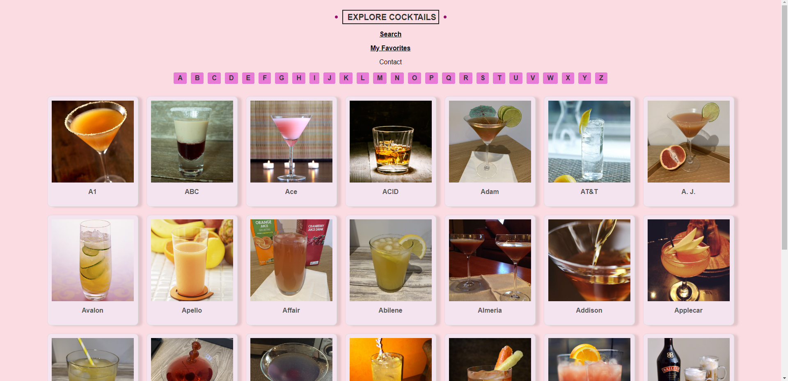

<h3 align="center">Cocktails</h3>

<!--  -->

<!-- 
 -->

---

 This is Webpage Which Lets you explore cocktails and add your Favorites List.  

## 📝 Table of Contents

- [📝 Table of Contents](#-table-of-contents)
- [🧐 About](#-about)
- [🚀 Deployment](#-deployment)
- [⛏️ Built Using](#️-built-using)
- [✍️ Authors](#️-authors)
- [🎉 Acknowledgements](#-acknowledgements)

## 🧐 About

This is a Cocktails Website. Here You can find your favorite cocktails and discover how this cocktail is made.

## 🚀 Deployment

Using Netlify.com We Deployed this webpage from our Github Repositories.

## ⛏️ Built Using

- Vanilla JavaScript ES6
- CSS3
- HTML5

## ✍️ Authors

- [@Ani](https://github.com/anniemmagh)
- [@Tako](https://github.com/tako-bochorishvili)
- [@Iovane](https://github.com/Iovane)
- [@T0rnik3](https://github.com/T0rnik3)

## 🎉 Acknowledgements

- [@G-Apxo](https://github.com/G-Apxo)
- Inspiration
- References
  - https://www.thecocktaildb.com/api.php
